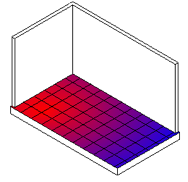
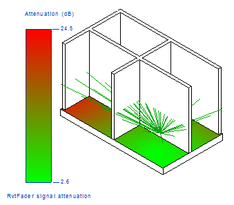
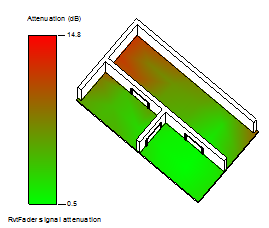

# RvtFader

C# .NET Revit add-in to calculate and display signal attenuation using AVF,
the [analysis visualisation framework](http://thebuildingcoder.typepad.com/blog/avf)
and `ReferenceIntersector` ray tracing.

## Task and Functionality

This application works in a Revit model with a floor plan containing walls.

It calculates the signal attenuation caused by distance and obstacles.

In the first iteration, the only obstacles taken into account are walls.

Two signal attenuation values in decibels per metre are defined in the application settings:

- Attenuation per metre in air
- Attenuation by a wall

Given a source point, calculate the attenuation in a widening circle around it and display that as a heat map.

We use the Revit API `ReferenceIntersector` ray tracing functionality to detect walls and
the [analysis visualisation framework AVF](http://thebuildingcoder.typepad.com/blog/avf) to display the heat map.

## Implementation Steps

You can follow the implementation steps in detail by looking at the [list of releases](releases).

Summary:

- Skeleton add-in using the [http://thebuildingcoder.typepad.com/blog/about-the-author.html#5.20](http://thebuildingcoder.typepad.com/blog/about-the-author.html#5.20).
- External command for the settings user interface displaying a Windows form and storing data in JSON as developed for the :
    - Display modal Windows form.
    - Implement form validation using `ErrorProvider` class, `Validating` and `Validated` events.
    - Store add-in option settings in JSON using the `JavaScriptSerializer` class.
- AVF heat map, initially simply based on distance from the selected source point:

- Graphical debugging displaying model lines representing the `ReferenceIntersector` rays traced using `ReferenceIntersector`:

- `AttenuationCalculator` taking walls and door openings into account:

## Further Reading

- **The Analysis Visualisation Framework AVF**:
    - An introduction to AVF programming basics is provided by Matt Mason's Autodesk University
class [CP5229 Seeing Data and More &ndash; The Analysis Visualization Framework](http://aucache.autodesk.com/au2011/sessions/5229/class_handouts/v1_CP5229-SeeingDataAndMore-TheAVFinRevitAPI.pdf)
([^](doc/cp5229_matt_mason_avf.pdf))
    - [Discussion of AVF by The Building Coder](http://thebuildingcoder.typepad.com/blog/avf)
- **`ReferenceIntersector` ray tracing**:
    - The `ReferenceIntersector` was previously named [`FindReferencesByDirection`](http://thebuildingcoder.typepad.com/blog/2010/01/findreferencesbydirection.html)
    - [Dimension walls using `FindReferencesByDirection`](http://thebuildingcoder.typepad.com/blog/2011/02/dimension-walls-using-findreferencesbydirection.html)
    - [Intersect Solid Filter, AVF vs DirectShape Debugging](http://thebuildingcoder.typepad.com/blog/2015/07/intersect-solid-filter-avf-and-directshape-for-debugging.html)
    - [Using `ReferenceIntersector` in linked files](http://thebuildingcoder.typepad.com/blog/2015/07/using-referenceintersector-in-linked-files.html)
- **Signal attenuation**:
    - [Attenuation](https://en.wikipedia.org/wiki/Attenuation)
    - [Modeling Signal Attenuation in IEEE 802.11 Wireless LANs - Vol. 1](http://www-cs-students.stanford.edu/~dbfaria/files/faria-TR-KP06-0118.pdf)
    - [The Basics of Signal Attenuation](http://www.dataloggerinc.com/content/resources/white_papers/332/the_basics_of_signal_attenuation/)
    - [RF Basics - Part 1](http://community.arubanetworks.com/aruba/attachments/aruba/tkb@tkb/121/1/RF-Basics_Part1.pdf) says "the free-space loss for 2.4 GHz at 100 meters from the transmitter is about 80 dB".

## Author

Jeremy Tammik,
[The Building Coder](http://thebuildingcoder.typepad.com),
[ADN](http://www.autodesk.com/adn)
[Open](http://www.autodesk.com/adnopen),
[Autodesk Inc.](http://www.autodesk.com)

## License

This sample is licensed under the terms of the [MIT License](http://opensource.org/licenses/MIT).
Please see the [LICENSE](LICENSE) file for full details.

